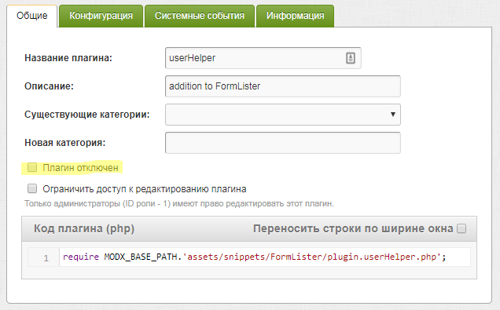

# Авторизация пользователей

Авторизация пользователей в `FormLister` осуществляется с использованием контроллера `Login`.

Содержание:

- [Выбор поля для авторизации](#field)
- [Авторизация, пример](#example)
- [Параметры контроллера](#params)
- [Параметры плагина userHelper](#plugin)

## <a name="field"></a> Выбор поля для авторизации

Поле для авторизации задается в параметре `loginField` и должно быть **уникальным** для каждого веб-пользователя.

Авторизация может осуществляться:

- по **базовым** полям средствами класса `modUsers`: `id`, `username` и `email`
- по любому **другому полю** из учетной записи (с помощью плагина для события `OnWebAuthentication`)

Дополнительное использование плагина [userHelper](https://github.com/evolution-cms/evolution/blob/develop/assets/snippets/FormLister/plugin.userHelper.php) позволяет:

- вести учет количества логинов
- определить время последней авторизации
- реализовать автологин и выход из учетной записи
- блокировать пользователей после определенного количества неудачных попыток авторизации

Перед использованием плагина `userHelper` убедитесь что он включен:



## <a name="example"></a> Пример вызова FormLister для авторизации веб-пользователей

```
[!FormLister?
    &formid=`login`
    &controller=`Login`
    &loginField=`email`
    &passwordField=`password`
    &rules=`{
        "email": {
            "required": "Обязательно введите email"
        },
        "password": {
            "required": "Обязательно введите пароль",
            "minLength": {
                "params": 6,
                "message": "В пароле должно быть больше 6 символов"
            }
        },
    }`
    &allowedFields=`email,password`
    &formTpl=`@CODE:
    <div class="register">
        <form method="post">
            <input type="hidden" name="formid" value="login">
            <div class="form-group[+email.errorClass+][+email.requiredClass+]">
                <label for="email"><i class="icon-gmail"></i></label>
                    <input type="text" class="form-control" id="email" placeholder="Email" name="email" value="[+email.value+]">
                    [+email.error+]
            </div>
            <div class="form-group[+password.errorClass+][+password.requiredClass+]">
                <label for="password"><i class="icon-cog"></i></label>
                <input type="password" class="form-control" id="password" placeholder="Пароль" name="password" value="">
                [+password.error+]
            </div>
            [+form.messages+]
            <div class="form-group">
                <button type="submit" class="btn btn-primary"><i class="icon-user"></i> Войти</button>
            </div>
        </form>
    </div>
    `
    &messagesOuterTpl=`@CODE:<div class="alert alert-danger" role="alert">[+messages+]</div>`
    &successTpl=`@CODE:<div>Поздравляем с успешной авторизацией, [+fullname.value+]!</div>`
    &errorTpl=`@CODE:<div class="alert alert-danger">[+message+]</div>`
    &requiredClass=` has-error`
    &errorClass=` has-error`
    &requiredClass=` has-error`
!]
```

## <a name="params"></a> Параметры контроллера

| параметр                                  | описание                                  | умолч.                            |
| ----------------------------------------- | ----------------------------------------- | --------------------------------- |
| [model](#param_model)                     | класс для работы с пользователями         | `\modUsers`                       |
| [modelPath](#param_modelpath)             | путь к файлу класса                       | `assets/lib/MODxAPI/modUsers.php` |
| [loginField](#param_loginfield)           | поле с именем                             | `username`                        |
| [passwordField](#param_passwordfield)     | поле с паролем                            | `password`                        |
| [rememberField](#param_rememberfield)     | запомнить для автологина                  | `rememberme`                      |
| [checkActivation](#param_checkactivation) | проверка активации                        | `1`                               |
| [context](#param_context)                 | контекст                                  | `web`                             |
| [cookieName](#param_cookiename)           | имя куки автологина                       | `WebLoginPE`                      |
| [cookieLifetime](#param_cookielifetime)   | время жизни куки автологина               | `157680000`                       |
| [redirectTo](#param_redirectto)           | переход после авторизации                 |                                   |
| [exitTo](#param_exitto)                   | переход авторизованного                   |                                   |
| [successTpl](#param_successtpl)           | шаблон сообщения об успешной авторизации  | `[+login.default_successTpl+]`    |
| [skipTpl](#param_skiptpl)                 | шаблон сообщения об имеющейся авторизации | `[+login.default_skipTpl+]`       |
| [dateFormat](#param_dateformat)           | формат даты dob                           |                                   |

### <a name="param_model"></a> model

Класс для работы с пользователями.

_Значения:_ имя класса. Для Evo 3.x следует использовать модель `Pathologic\EvolutionCMS\MODxAPI\modUsers` из пакета `pathologic/modxapi`.

_По умолчанию:_ `\modUsers`

### <a name="param_modelpath"></a> modelPath

Путь к файлу класса для работы с пользователями.

_Значения:_ относительный путь к файлу.

_По умолчанию:_ `assets/lib/MODxAPI/modUsers.php`

### <a name="param_loginfield"></a> loginField

Поле, содержащее имя пользователя.

_Значения:_ имя поля.

_По умолчанию:_ `username`.

### <a name="param_passwordfield"></a> passwordField

Поле, содержащее пароль пользователя.

_Значения:_ имя поля.

_По умолчанию:_ `password`.

### <a name="param_rememberfield"></a> rememberField

Поле для запоминания пользователя.

Если значение поля приводится к `true`, то при успешной авторизации будет установлена кука с параметрами автологина.
Имя куки и ее время жизни задаются параметрами `cookieName` и `cookieLifetime`.

_Значения:_ имя поля.

_По умолчанию:_ `rememberme`.

### <a name="param_checkactivation"></a> checkActivation

Включает проверку активации учетной записи пользователя (см. "Активация учетных записей").

_Значения:_ `0`, `1`.

_По умолчанию:_ `1`.

### <a name="param_context"></a> context

Контекст авторизации.

_Значения:_ `mgr`, `web`.

_По умолчанию:_ `web`.

### <a name="param_cookiename"></a> cookieName

Имя куки для хранения параметров автологина.

_По умолчанию:_ `WebLoginPE`.

### <a name="param_cookielifetime"></a> cookieLifetime

Время жизни вышеуказанной куки.

_Значения:_ число секунд с момента последнего логина.

_По умолчанию:_ `157680000` (5 лет).

### <a name="param_redirectto"></a> redirectTo

Перенаправляет пользователя на страницу c указанным `id` после авторизации.

_Значения:_ `id` целевой страницы или массив.

_По умолчанию:_ нет значения.

### <a name="param_exitto"></a> exitTo

Перенаправляет уже авторизованного пользователя на страницу c указанным `id`.

_Значения:_ `id` целевой страницы или массив.

_По умолчанию:_ нет значения.

### <a name="param_successtpl"></a> successTpl

Шаблон сообщения об успешной авторизации. В шаблоне можно использовать данные пользователя.

_Значения:_ имя шаблона, указанное по правилам задания шаблонов в DocLister.

_По умолчанию:_ запись из лексикона `Login` с ключом `[+login.default_successTpl+]`

### <a name="param_skiptpl"></a> skipTpl

Шаблон сообщения о том, что пользователь уже авторизован.

_Значения:_ имя шаблона, указанное по правилам задания шаблонов в DocLister.

_По умолчанию:_ запись из лексикона `Login` с ключом `[+login.default_skipTpl+]`

### <a name="param_dateformat"></a> dateFormat

Формат даты для поля dob.

_Значения:_ формат даты по правилам функции date (например, "d.m.Y").

## <a name="plugin"></a> Параметры плагина userHelper

| параметр                                  | описание                     | умолч.         |
| ----------------------------------------- | ---------------------------- | -------------- |
| [logoutKey](#plugin_logoutkey)            | get-параметр для выхода      | `logout`       |
| [cookieName](#plugin_cookiename)          | кука автологина              | `WebLoginPE`   |
| [cookieLifetime](#plugin_cooikielifetime) | время жизни куки автологина  | cookieLifetime |
| [maxFails](#plugin_maxfails)              | количество неудачных попыток | `3`            |
| [blockTime](#plugin_blocktime)            | время блокировки             |                |

### <a name="plugin_logoutkey"></a> logoutKey

Имя GET-параметра для запуска выхода из учетной записи.

Если в ссылке на страницу сайта указан параметр с соответствующим именем (например, `http://sitename.ru/page.html?logout`), будет произведен выход из учетной записи.

_По умолчанию:_ `logout`.

### <a name="plugin_cookiename"></a> cookieName

Имя куки для хранения параметров автологина.

_По умолчанию:_ `WebLoginPE`.

### <a name="plugin_cookielifetime"></a> cookieLifetime

Время жизни вышеуказанной куки.

_Значения:_ число секунд с момента последнего логина.

_По умолчанию:_ `157680000` (5 лет).

### <a name="plugin_maxfails"></a> maxFails

Количество попыток для ввода учетных данных.

_Значения:_ число больше `0`.

_По умолчанию:_ `3`.

### <a name="plugin_blocktime"></a> blockTime

Время блокировки пользователя.

_Значения:_ число секунд с момента последнего логина.

_По умолчанию:_ `3600` (1 час).
