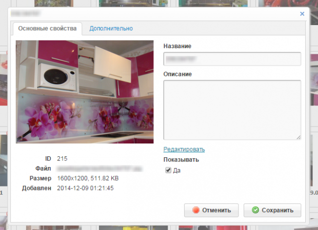
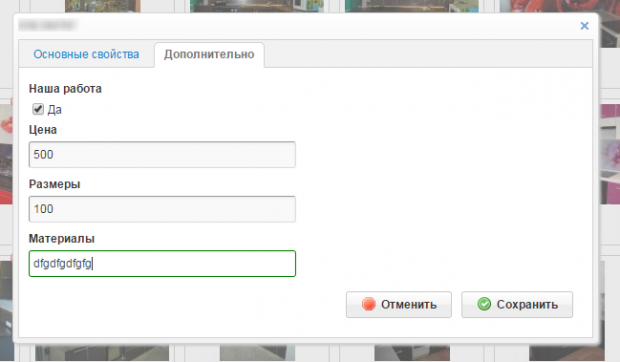
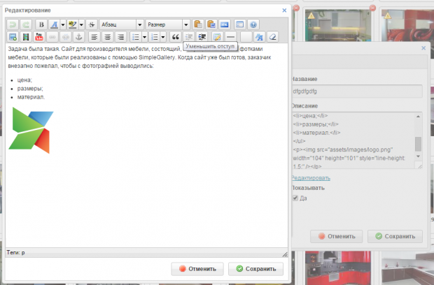

# Разработчикам

- [Создание плагинов](#plugins1)
- [Изменение логики работы и интерфейса](#plugins2)
- [Динамическое изменение параметров](#plugins3)

## <a name="plugins1"></a> Создание плагинов (расширение функционала, часть 1)

> старая ссылка на оригинал http://modx.im/blog/docs/3006.html

> автор статьи - Pathologic

Среди достоинств `SimpleGallery` есть возможность изменять логику работы, не опасаясь потерять эти изменения с очередным обновлением (ну, почти не опасаясь).

Возможности даже три — можно писать плагины, можно расширять классы, можно загружать свои js-скрипты.

В этой статье опишу события для плагинов, а в следующий раз покажу пример более радикального вмешательства с изменением не только логики работы, но и интерфейса.

На сегодняшний день в `SimpleGallery` можно использовать четыре события.

### OnFileBrowserUpload

Событие происходит после успешной загрузки файла.

_Доступные переменные:_

- `$filepath` — путь к файлу, без слеша в конце (например _/var/www/test/www/assets/galleries/5_);
- `$filename` — имя файла (например _image.jpg_);
- `$template` — id шаблона галереи;
- `$rid`— id ресурса с галереей.

_Применение:_ обработка загруженных изображений и генерация превью.

### OnSimpleGallerySave

Событие происходит после записи информации о файле в базу, т.е. после успешной загрузки файла и после сохранения формы редактирования.

_Доступные переменные:_

- названия полей в базе (`sg_id`, `sg_image` и т.д.);
- `$template` — id шаблона галереи;
- `$newDoc` — если `true`, то событие произошло при добавлении данных о файле, иначе — при редактировании.

Для новых файлов это событие можно считать частным случаем события `OnFileBrowserUpload`, которое происходит после загрузки файлов вообще (т.е. и через управление файлами, и через KCFinder).

_Применение:_ дополнительная обработка данных в БД.

### OnSimpleGalleryDelete

Событие происходит после того, как из базы удаляется информация о файле.

_Доступные переменные:_

- `$id` — значение поля `sg_id` для удаленного файла;
- `$filepath` — путь к файлу, без слеша в конце;
- `$filename` — имя файла;
- `$name` — имя файла без расширения;
- `$ext` — расширение файла;
- `$mime` — MIME-тип файла;
- `$template` — id шаблона галереи.

_Применение:_ удаление сгенерированных при загрузке превьюшек.

### OnSimpleGalleryRefresh

Событие происходит после того, как администратор нажмет соответствующую кнопку и позволяет выполнить какую-то обработку уже загруженных файлов. По сути это событие `OnSimpleGallerySave` с установленным флагом `$newDoc`.

_Доступные переменные:_ те же, что и для `OnSimpleGallerySave`, кроме `$newDoc`.

_Применение:_ пересоздать превью с новыми параметрами.

### Пример плагина

И чтобы было понятно, вот пример плагина, который:

- создает превьюшки при загрузке и сохраняет их в подпапку small;
- удаляет их при удалении картинок;
- позволяет сгенерировать превьюшки для уже загруженных ранее картинок;
- также будет очищать поле sg_title для новых картинок (для тех, кто страдает seo).

> плагин для версии 1.4.x, для версии 3 потребуются мелкие доработки

```php
$e = &$modx->event;

if ($e->name == "OnFileBrowserUpload" && isset($template)) {
        $thumb = new \Helpers\PHPThumb();
        $fs = \Helpers\FS::getInstance();
        $fs->makeDir($filepath.'/small');
        $thumb->create($filepath.'/'.$filename,$filepath.'/small/'.$filename,'w=350&h;=245&zc;=1&q;=96&f;=jpg');
}
if ($e->name == "OnSimpleGalleryRefresh") {
        $fs = \Helpers\FS::getInstance();
        $filepath = $fs->takeFileDir($sg_image);
        $filename = $fs->takeFileBasename($sg_image);
        $thumb = new \Helpers\PHPThumb();
        $fs->makeDir($filepath.'/small');
        $thumb->create($filepath.'/'.$filename,$filepath.'/small/'.$filename,'w=350&h;=245&zc;=1&q;=96&f;=jpg');
}
if ($e->name == "OnSimpleGalleryDelete") {
        $fs = \Helpers\FS::getInstance();
        $file = $filepath.'/small/'.$filename;
        if (file_exists($file)) unlink($file);
}
if ($e->name == "OnSimpleGallerySave") {
        if ($newDoc) {
            $data = new \SimpleGallery\sgData($modx);
            $data->edit($sg_id)->set('sg_title',' ')->save();
        }
}
```

Как видно из примера, в событиях доступны классы `\SimpleGallery\sgData`, `\Helpers\FS` и `\Helpers\PHPThumb`, чем я и воспользовался, чтобы не усложнять плагин.

Если выводить через `sgLister`, то нужно создать сниппет, который будет добавлять `small/` перед именем файла:

```php
<?php
//mythumb
$file = end(explode('/',$input));
return str_replace($file,$options.'/'.$file,$input);
```

И указать параметры: `&thumbSnippet;="mythumb" &thumbOptions;="small"`.

## <a name="plugins2"></a> Изменение логики работы и интерфейса (расширение функционала, часть 2)

> старая ссылка на оригинал http://modx.im/blog/docs/3277.html

> автор статьи - Pathologic

В этой статье речь пойдет о том, как изменить интерфейс `SimpleGallery` под конкретную задачу. При этом файлы плагина останутся без изменений — а значит, работа не пропадет после обновления `SimpleGallery`. Дальше много текста и говнокода.

_Задача была такая:_ cайт для производителя мебели, состоящий, по сути, из галерей с фотками мебели, которые были реализованы с помощью SimpleGallery. Когда сайт уже был готов, заказчик внезапно пожелал, чтобы с фотографией выводились: цена; размеры; материал.

Кроме этого, для некоторых фотографий нужно показывать значок «Наша работа». Ну и пусть поле «Описание» редактируется с помощью TinyMCE (: А чтобы было красиво, основные поля и дополнительные поля будут редактироваться в отдельных вкладках.

Для решения задачи нужно изменить форму редактирования картинки, добавив туда дополнительные поля, а также внести изменения в контроллер и класс, отвечающий за работу с базой данных (модель).

Так как выборки и сортировки по новым полям не нужны, было решено не создавать дополнительные поля в таблице, а воспользоваться полем `sg_properties`, в котором хранятся параметры картинки в формате json. А для флажка «Наша работа» пригодится существующее поле `sg_add`.

### Расширение классов

Так как было решено не добавлять дополнительные поля в таблицу, то достаточно внести изменения в контроллер. А именно изменить метод `edit`. Для этого создадим файл `custom.class.php` в папке `assets/plugins/simplegallery/lib/`:

```php
<?php
namespace SimpleGallery;

require_once (MODX_BASE_PATH.'assets/plugins/simplegallery/lib/controller.class.php');

//расширяем класс sgController
class customController extends sgController{
    public function edit(){
        $out = array();
        $id = isset($_REQUEST['sg_id']) ? (int)$_REQUEST['sg_id'] : 0;
        if ($id) {
            $fields = array(
                'sg_title' => $_REQUEST['sg_title'],
                'sg_description' => $_REQUEST['sg_description'],
                'sg_add' => $_REQUEST['sg_add']
            );
            $fields['sg_isactive'] = isset($_REQUEST['sg_isactive']) ? 1 : 0;
            $row = $this->data->edit($id);
            $_data = $row->toArray();
            //получили значения дополнительных полей
            $addProperties = array(
                'price'    => $_REQUEST['price'],
                'msize'    => $_REQUEST['msize'],
                'material' => $_REQUEST['material']
            );
            //добавили их в поле sg_properties
            $_data['sg_properties'] = array_merge($_data['sg_properties'],$addProperties);
            //отправили все поля на сохранение
            $_data = array_merge($_data,$fields);
            $out['success'] = $row->fromArray($_data)->save();
        } else {
            $out['success'] = false;
        }
        return $out;
    }
}
```

Теперь в настройки плагина `SimpleGallery` вписываем имя нашего класса (`SimpleGallery\customController`) и создаем еще один плагин на событие `OnManagerPageInit`, который этот класс загрузит:

> плагин для версии 1.4.x, для версии 3 потребуются мелкие доработки

```php
$e = $modx->event;

if ($e->name == "OnManagerPageInit") {
    if (isset($invokedBy) && $invokedBy=="SimpleGallery")
        include_once(MODX_BASE_PATH.'assets/plugins/simplegallery/lib/custom.class.php');
}
```

На этом с серверной частью все.

### Изменение интерфейса

Здесь возникает две подзадачи. Во-первых, нужно изменить форму редактирования, во-вторых, внести изменения в обработку этой формы.

Если посмотреть папку `assets/plugins/simplegallery/js/tpl/`, то можно обнаружить там файлы с расширением `*.handlebars`. Это шаблоны для js-шаблонизатора `Handlebars`, в которые вынесены формы `SimpleGallery` + шаблон для превьюшки.

Синтаксис `Handlebars` достаточно простой и работа с такими шаблонами не сильно отличается от работы с чанками. Однако простое изменение файла `editForm.handlebars` ничего не даст — шаблоны нужно компилировать. Этот аспект я рассматривать не буду, скажу лишь, что потребуется установить где-нибудь `nodejs` и прочитать небольшую инструкцию в файле `readme.txt`, который можно найти в папке с шаблонами.

Создадим файл `editFormMebel.handlebars`:

```html
<div id="editTabs" class="easyui-tabs">
  <!-- Первая вкладка -->
  <div title="Основные свойства">
    <div id="sgEdit">
      <div class="sgRow">
        <div style="font-size:0;text-align:center;">
          
        </div>
        <div>
          <table>
            <tr>
              <td class="rowTitle">ID</td>
              <td>{{data.sg_id}}</td>
            </tr>
            <tr>
              <td class="rowTitle">{{sgLang.file}}</td>
              <td>{{data.sg_image}}</td>
            </tr>
            <tr>
              <td class="rowTitle">{{sgLang.size}}</td>
              <td>
                {{data.sg_properties.width}}x{{data.sg_properties.height}},
                {{bytesToSize data.sg_properties.size}}
              </td>
            </tr>
            <tr>
              <td class="rowTitle">{{sgLang.createdon}}</td>
              <td>{{data.sg_createdon}}</td>
            </tr>
          </table>
        </div>
      </div>
      <div class="sgRow">
        <div>
          <form id="sgForm" class="sgForm">
            <input type="hidden" name="sg_id" value="{{data.sg_id}}" />
            <label>{{sgLang.title}}</label>
            <input
              name="sg_title"
              maxlength="255"
              type="text"
              value="{{data.sg_title}}"
            />
            <label>{{sgLang.description}}</label>
            <textarea name="sg_description">{{data.sg_description}}</textarea>
            <a href="javascript:" class="btn-rte">Редактировать</a>
            <label>{{sgLang.show}}</label>
            <input type="checkbox" name="sg_isactive" value="1"{{#ifCond
            data.sg_isactive "1"}} checked{{/ifCond}}>{{sgLang.yes}}
          </form>
        </div>
      </div>
      <div style="clear:both;padding:10px;float:right;">
        <div class="sgEditSave btn btn-right">
          <div class="btn-text">
            
            {{sgLang.save}}
          </div>
        </div>
        <div class="sgEditCancel btn btn-right">
          <div class="btn-text">
            
            {{sgLang.cancel}}
          </div>
        </div>
      </div>
    </div>
  </div>
  <!-- Вторая вкладка -->
  <div title="Дополнительно" style="padding:10px;display:none;">
    <form id="sgAdd" class="sgForm">
      <label>Наша работа</label>
      <input type="checkbox" name="sg_add" value="1"{{#ifCond data.sg_isactive
      "1"}} checked{{/ifCond}}>{{sgLang.yes}}
      <label>Цена</label>
      <input type="text" name="price" value="{{data.sg_properties.price}}" />
      <label>Размеры</label>
      <input type="text" name="msize" value="{{data.sg_properties.msize}}" />
      <label>Материалы</label>
      <input
        type="text"
        name="material"
        value="{{data.sg_properties.material}}"
      />
    </form>
    <div style="clear:both;padding:10px;float:right;">
      <div class="sgEditSave btn btn-right">
        <div class="btn-text">
          
          {{sgLang.save}}
        </div>
      </div>
      <div class="sgEditCancel btn btn-right">
        <div class="btn-text">
          
          {{sgLang.cancel}}
        </div>
      </div>
    </div>
  </div>
</div>
```

Разметка, конечно, не очень, но не важно. Компилируем:

```sh
handlebars editFormMebel.handlebars -f editFormMebel.js -m
```

Эта команда скомпилирует шаблон в файл `editFormMebel.js` и минифицирует его.

Теперь создадим еще одну форму, для редактирования описания с помощью `TinyMCE`. Эта форма будет показываться в окошке, если кликнуть по ссылке «Редактировать». Файл `rteForm.handlebars`:

```html
<div id="rteForm">
  <div style="width:600px;">
    <textarea id="rteField" style="width:99%;height:400px;">
{{textarea}}</textarea
    >
  </div>
  <div style="clear:both;padding:10px;float:right;">
    <div id="rteSave" class="btn btn-right">
      <div class="btn-text">
        
        {{sgLang.save}}
      </div>
    </div>
    <div id="rteCancel" class="btn btn-right">
      <div class="btn-text">
        
        {{sgLang.cancel}}
      </div>
    </div>
  </div>
</div>
```

Компилируем:

```sh
handlebars rteForm.handlebars -f rteForm.js -m
```

Файлы `editFormMebel.js` и `rteForm.js` копируем в `assets/plugins/simplegallery/js/tpl/`

Теперь добавим методы для вызова окошка с формой редактирования описания, для инициализации `TinyMCE`, а также изменим метод `sgHelper.edit()`. Создаем в папке `assets/plugins/simplegallery/js/plugin/` файл `editForm.js`:

```js
(function ($) {
  sgHelper.rteForm = function (textarea) {
    //готовим данные для передачи в шаблон
    var context = {
      textarea: textarea.val(),
      modxTheme: sgConfig._modxTheme,
      modxSiteUrl: sgConfig._modxSiteUrl,
      sgLang: _sgLang,
    };
    //получаем заполненный шаблон
    var rteForm = $(Handlebars.templates.rteForm(context));
    //создаем окошко
    rteForm.window({
      modal: true,
      title: "Редактирование",
      collapsible: false,
      minimizable: false,
      maximizable: false,
      resizable: false,
      onOpen: function () {
        //когда окошко создано, нужно назначить обработчики для кнопок в форме
        $("#rteCancel").click(function (e) {
          rteForm.window("close", true);
        });
        $("#rteSave").click(function (e) {
          //берем то, что наредактировали и сохраняем обратно в поле "Описание"
          var content = tinyMCE.activeEditor.getContent();
          textarea.val(content);
          rteForm.window("close", true);
        });
        //цепляем редактор к полю в форме
        sgHelper.initRTE();
      },
      onClose: function () {
        //если окошко закрывается, то удаляем его вообще
        //после закрытия окна с редактором нужно восстановить оверлей
        var mask = $(".window-mask");
        sgHelper.destroyWindow(rteForm);
        $("body").append(mask);
      },
    });
  };

  sgHelper.edit = function (image) {
    var data = image.data("properties");
    var context = {
      data: data,
      modxTheme: sgConfig._modxTheme,
      modxSiteUrl: sgConfig._modxSiteUrl,
      sgLang: _sgLang,
    };
    //получаем форму редактирования
    var editForm = $(Handlebars.templates.editFormMebel(context));
    editForm.window({
      modal: true,
      title: sgHelper.escape(this.stripText(data.sg_title, 80)),
      doSize: true,
      collapsible: false,
      minimizable: false,
      maximizable: false,
      resizable: false,
      onOpen: function () {
        //создаем вкладки
        $("#editTabs").tabs({
          border: false,
          onSelect: function (title, index) {
            if (index) {
              var tab = $("#editTabs").tabs("getTab", index);
              $(tab).show();
              editForm.window("resize");
            }
          },
        });
        //обработчики кнопок
        //показываем окошко с редактором
        $(".btn-rte").click(function (e) {
          sgHelper.rteForm($("textarea", "#sgEdit"));
        });
        $(".sgEditCancel").click(function (e) {
          editForm.window("close", true);
        });
        $(".sgEditSave").click(function (e) {
          $.post(
            sgConfig._xtAjaxUrl + "?mode=edit",
            $("#sgForm,#sgAdd").serialize(),
            function (data) {
              data = sgHelper.getData(data);
              if (data.success) {
                editForm.window("close", true);
                sgHelper.update();
              } else {
                $.messager.alert(_sgLang["error"], _sgLang["save_fail"]);
              }
            }
          );
        });
      },
      onClose: function () {
        sgHelper.destroyWindow(editForm);
      },
    });
  };
})(jQuery);
```

Инициализацию `TinyMCE` я вынес в отдельный файл, `assets/plugins/simplegallery/js/plugin/tinymce.js`:

```js
(function ($) {
  sgHelper.initRTE = function () {
    tinyMCE.init({
      theme: "advanced",
      skin: "cirkuit",
      skin_variant: "",
      mode: "exact",
      elements: "rteField",
      width: "100%",
      height: "500",
      language: "ru",
      element_format: "xhtml",
      schema: "html4",
      paste_text_use_dialog: true,
      document_base_url: sgConfig._modxSiteUrl,
      relative_urls: true,
      remove_script_host: true,
      convert_urls: true,
      force_br_newlines: false,
      force_p_newlines: true,
      forced_root_block: "p",
      valid_elements: mce_valid_elements,
      popup_css_add: "/assets/plugins/tinymce/style/popup_add.css",
      theme_advanced_source_editor_height: 400,
      accessibility_warnings: false,
      theme_advanced_toolbar_location: "top",
      theme_advanced_statusbar_location: "bottom",
      theme_advanced_toolbar_align: "ltr",
      theme_advanced_font_sizes:
        "80%,90%,100%,120%,140%,160%,180%,220%,260%,320%,400%,500%,700%",
      content_css: "/assets/plugins/tinymce/style/content.css",
      formats: {
        alignleft: {
          selector: "p,h1,h2,h3,h4,h5,h6,td,th,div,ul,ol,li,table,img",
          classes: "justifyleft",
        },
        alignright: {
          selector: "p,h1,h2,h3,h4,h5,h6,td,th,div,ul,ol,li,table,img",
          classes: "justifyright",
        },
        alignfull: {
          selector: "p,h1,h2,h3,h4,h5,h6,td,th,div,ul,ol,li,table,img",
          classes: "justifyfull",
        },
      },
      apply_source_formatting: true,
      remove_linebreaks: false,
      convert_fonts_to_spans: true,
      plugins:
        "visualblocks,autolink,inlinepopups,autosave,save,advlist,style,fullscreen,advimage,paste,advlink,media,contextmenu,table,youtubeIframe",
      theme_advanced_buttons1:
        "undo,redo,|,bold,forecolor,backcolor,strikethrough,formatselect,fontsizeselect,pastetext,pasteword,code,|,fullscreen,help",
      theme_advanced_buttons2:
        "image,media,youtubeIframe,link,unlink,anchor,|,justifyleft,justifycenter,justifyright,|,bullist,numlist,|,blockquote,outdent,indent,|,table,hr,|,visualblocks,styleprops,removeformat",
      theme_advanced_buttons3: "",
      theme_advanced_buttons4: "",
      theme_advanced_resize_horizontal: false,
      external_link_list_url: "/assets/plugins/tinymce/js/tinymce.linklist.php",
      template_external_list_url: "/assets/plugins/tinymce/js/get_template.php",
      template_popup_width: 550,
      template_popup_height: 350,
      theme_advanced_blockformats:
        "p,h1,h2,h3,h4,h5,h6,div,blockquote,code,pre",
      theme_advanced_styles: "left=justifyleft;right=justifyright",
      theme_advanced_disable: "",
      theme_advanced_resizing: true,
      fullscreen_settings: {
        theme_advanced_buttons1_add_before: "save",
      },
      plugin_insertdate_dateFormat: "%d-%m-%Y",
      plugin_insertdate_timeFormat: "%H:%M:%S",
      entity_encoding: "named",
      file_browser_callback: "mceOpenServerBrowser",
      paste_text_sticky: true,
      setup: function (ed) {
        ed.onPostProcess.add(function (ed, o) {
          // State get is set when contents is extracted from editor
          if (o.get) {
            o.content = o.content.replace("<p>{" + "{", "{" + "{");
            o.content = o.content.replace("}}</p>", "}}");
            o.content = o.content.replace(/<p>\[([\[\!\~\^])/g, "[$1");
            o.content = o.content.replace(/([\]\!\~\^])\]<\/p>/g, "$1]");
          }
        });
      },
      onchange_callback: false,
      valid_elements: "*[*]",
    });
  };
})(jQuery);
```

Здесь я просто взял код инициализации `TinyMCE` из редактирования документа. Да, нужно учитывать, чтобы это все работало, на странице должен быть включен `TinyMCE`.

Теперь создаем в папке `assets/plugins/simplegallery/js/` файл `custom.json`:

```json
{
  "scripts": {
    "editFormMebelTemplate": {
      "version": "1.0.0",
      "src": "assets/plugins/simplegallery/js/tpl/editFormMebel.js"
    },
    "editForm": {
      "version": "1.0.0",
      "src": "assets/plugins/simplegallery/js/plugin/editForm.js"
    },
    "sgTinyMCE": {
      "version": "0.0.0",
      "src": "assets/plugins/simplegallery/js/plugin/tinymce.js"
    },
    "rteForm": {
      "version": "1.4.1",
      "src": "assets/plugins/simplegallery/js/tpl/rteForm.js"
    }
  }
}
```

Если есть файл `custom.json`, то `SimpleGallery` загружает из него скрипты дополнительно к скриптам, описанным в файле `scripts.json`. Аналогично загружаются и css-файлы.

На этом работа закончена. Итак, измененная форма:



Вкладка с дополнительными полями:



Редактор:



Редактор описания мне понадобился сегодня для другого сайта, поэтому я решил положить его в коробку (: Так что если кому-то вдруг нужно, но разбираться лень, то достаточно переименовать файл `_custom.json`.

## <a name="plugins3"></a> Динамическое изменение параметров (расширение функционала, часть 3)

> старая ссылка на оригинал http://modx.im/blog/docs/3321.html

> автор статьи - Pathologic

В очередной версии появилось новое событие `OnParseProperties`, которое сразу вызвало у меня интерес.

Событие срабатывает при разборе параметров сниппетов и плагинов, что позволяет эти параметры подменять. И хотя параметры плагинов пока обрабатываются как-то криво, можно воспользоваться событием `OnParseProperties` для вмешательства в работу `SimpleGallery`.

Есть сайт, где реализовано две галереи с помощью `SimpleGallery` — в одной картинки с образцами продукции, а во второй хранятся фотографии сотрудников с их биографиями (по смыслу это не совсем галерея, просто удобно их хранить так, а не в документах). Логично было бы вкладки с галереями подписать по-разному, но в `SimpleGallery` название вкладки (в данном случае — «Галерея») задается в параметрах плагина, который может быть только один. Выход из положения — плагин на событие `OnParseProperties`:

> формат плагина для версии 1.4.х, для версии 3 потребуется небольшая доработка

```php
$e = &$modx->event;

if ($e->name == "OnParseProperties") {
    if ($element == "SimpleGallery") {
        if (isset($args['template']) && $args['template'] == 6) {
            $out = array ();
            //задаем новое значение параметра tabName
            $out["tabName"] = "Сотрудники";
            $e->_output = $out;
        }
    }
}
```

Теперь для страницы «Список сотрудников» с шаблоном 6 вкладка будет называться «Сотрудники», а во всех остальных случаях — «Галерея». Можно проверять и `$args['id']` — id страницы, на которой вызывается плагин.

Немного подумав, я решил сделать возможность подменять в `onParseProperties` не только параметры плагина, но и свойства соответствущего ему класса. Таким образом появляется возможность использовать произвольные списки загружаемых js- и css-файлов, что в сочетании с параметром `controller` позволяет (в теории) менять интерфейс и логику работы плагина для разных страниц. Например, для разных типов галерей можно использовать разные наборы дополнительных полей.

Аналогично можно изменить работу и других моих плагинов, тем более, что они все делаются из общей заготовки. Например в `SimpleFiles` теперь появляется возможность создавать разные типы файловых архивов (например, в одном документе храним только zip, в другом только doc и xls), меняя с помощью события `OnParseProperties` список разрешенных для загрузки файлов.
