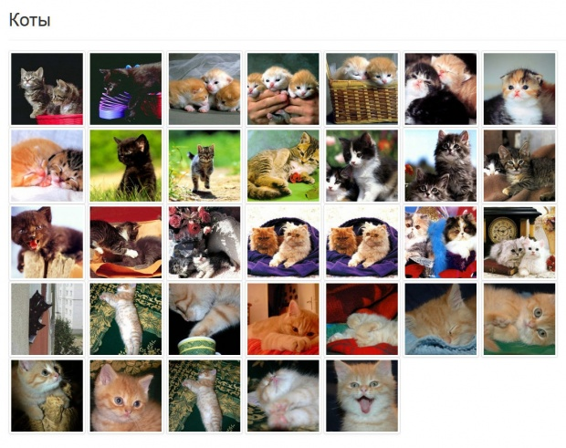
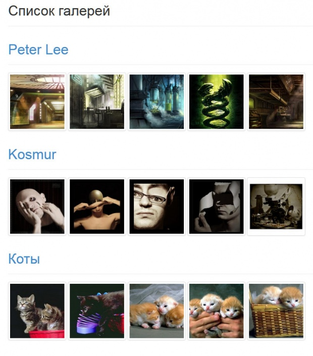

# Примеры вывод картинок

- [Вывод галереи на странице](#gallery)
- [Вывод списка галерей](#galleries)

## <a name="gallery"></a> Вывод галереи на странице

Важное достоинство `DocLister` заключается в том, что теперь не нужно городить свои велосипеды для вывода данных из любых таблиц: не нужно придумывать названия параметров (чтобы потом в них путаться), пагинации, сортировки и т.п. Всю нудную работу сделал `Agel_Nash`, за что ему в очередной раз спасибо.

Для работы с произвольными таблицами в `DocLister` есть контроллер `onetable`. Все что нужно знать — это название таблицы, названия ее полей, название ключевого поля. Все остальное есть в документации.

Еще раз приведу названия полей в таблице sg_images:

| поле             | описание                                                                                                                             |
| ---------------- | ------------------------------------------------------------------------------------------------------------------------------------ |
| `sg_id`          | id картинки, ключевое поле (idField)                                                                                                 |
| `sg_index`       | позиция в списке                                                                                                                     |
| `sg_image`       | ссылка на картинку                                                                                                                   |
| `sg_title`       | название картинки                                                                                                                    |
| `sg_description` | описание картинки                                                                                                                    |
| `sg_properties`  | здесь в формате json хранится информация о ширине и высоте картинки, а также размере файла, можно еще что-нибудь хранить в этом поле |
| `sg_add`         | дополнительное поле, сейчас уже не помню, зачем оно мне было нужно                                                                   |
| `sg_isactive`    | флажок, чтобы скрыть какие-то картинки из вывода                                                                                     |
| `sg_rid`         | id ресурса, которому принадлежит картинка (parentField)                                                                              |
| `sg_createdon`   | дата добавления картинки                                                                                                             |

Зная это, чтобы вывести картинки из галереи, достаточно сделать такой вызов на странице с галереей:

```
[[DocLister?
  &controller=`onetable`
  &table=`sg_images`
  &idField=`sg_id`
  &parentField=`sg_rid`
  &idType=`parents`
  &addWhereList=`sg_isactive=1`
  &tpl=`@CODE:[+sg_image+] [+sg_title+]`
  &showParent=`-1`
]]
```

Результат:

```
assets/galleries/2/kitty099h.jpg kitty099h
assets/galleries/2/kitty098p.jpg kitty098p
assets/galleries/2/kitty096j.jpg kitty096j
assets/galleries/2/kitty095s.jpg kitty095s
assets/galleries/2/kitty094c.jpg kitty094c
assets/galleries/2/kitty093p.jpg kitty093p
```

Если на страницу добавить `[+pages+]`, а к вызову добавить `&paginate='pages' &display='10'` — получим пагинацию.

То есть вывод из своей таблицы не сильно отличается от обычного вывода документов.

Чтобы не писать каждый раз `&controller='onetable' &table='sg_images' &idField='sg_id'`, я сделал сниппет-обертку `sgLister`.

Agel_Nash этот сниппет доработал и теперь при его вызове происходит дополнительная обработка полей, в чанке можно использовать такие плейсхолдеры:

| плейсхолдер                                             | описание                                                                                                                                |
| ------------------------------------------------------- | --------------------------------------------------------------------------------------------------------------------------------------- |
| `[+thumb.sg_image+]`                                    | превьюшка                                                                                                                               |
| `[+thumb.width.sg_image+]`, `[+thumb.height.sg_image+]` | ее размеры                                                                                                                              |
| `[+e.sg_title+] и [+e.sg_description+]`                 | значения полей `sg_title` и `sg_description`, преобразованы в html-сущности (чтобы не поломать случайно верстку кавычками или скобками) |
| `[+properties.имя*свойства+]`                           | свойства картинки из поля `sg_properties`                                                                                               |

Использовать поле `[+thumb.sg_image+]` можно, если при вызове добавить параметры:

- `&thumbSnippet` — имя сниппета, который вернет ссылку на превью, например, `phpthumb`
- `&thumbOptions` — параметры для создания превью, в том виде, в каком их примет указанный сниппет.

На практике это выглядит так:

```
[[sgLister?
    &thumbSnippet=`phpthumb`
    &thumbOptions=`w=150&h;=150&zc;=1`
    &tpl=`@CODE:
        <a href="[+sg_image+]">
            
        </a>`]]
```

Результат:



## <a name="galleries"></a> Вывод списка галерей

Такая задача возникает не так часто, но все же возникает, поэтому я расширил контроллер `site_content`, чтобы получить возможность добавить картинки из галерей при выводе списка:



Вызов DocLister выглядит так:

```
[[DocLister?
    &controller=`sg_site_content`
    &prepare=`prepareImages`
    &sgOrderBy=`sg_id DESC`
    &tpl=`@CODE:
        <div class="page-header">
            <h1><a href="[+url+]">[+pagetitle+]</a></h1>
        </div>
        [+images+]
        <div class="clearfix"></div>`
    &sgOuterTpl=`@CODE:[+wrapper+]`
    &sgRowTpl=`@CODE:
        <a href="[+sg_image+]">
            
        </a>`
    &sgDisplay=`5`
]]
```

То есть то же самое, что простой вывод документов, но добавлены дополнительные параметры:

| параметр                    | описание                                             |
| --------------------------- | ---------------------------------------------------- |
| `&sgOuterTpl` и `&sgRowTpl` | чанки для вывода картинок                            |
| `&sgOrderBy`                | параметры сортировки картинок                        |
| `&sgDisplay`                | сколько картинок выводить, `all` — чтобы вывести все |
| `&sgAddWhereList`           | здесь можно указать условия для выборки картинок     |

Для того, чтобы вывести в чанке документа `&tpl` эти картинки, следует использовать плейсхолдер `[+images+]`. Однако если просто вписать `[+images+]`, то картинки не выведутся (потому что images — это массив). Нужен prepare-сниппет для дополнительной обработки (назовем его `prepareImages`):

```php
<?php
if (isset($data['images'])) {
    $wrapper= '';
    foreach ($data['images'] as $image) {
        $ph = $image;
        $ph['thumb.sg_image'] = $modx->runSnippet('phpthumb',array(
            'input' => $image['sg_image'],
            'options' => 'w=150&h;=150&zc;=1'
        ));
        //сделали превьюшку

        $ph['e.sg_title'] = htmlentities($image['sg_title'], ENT_COMPAT, 'UTF-8', false);
        $ph['e.sg_description'] = htmlentities($image['sg_description'], ENT_COMPAT, 'UTF-8', false);
        //добавили поля e.sg_title и e.sg_description

        $wrapper .= $_DocLister->parseChunk($_DocLister->getCFGDef('sgRowTpl'), $ph);
        //обработали чанк sgRowTpl - для каждой картинки
    }
    $data['images'] = $_DocLister->parseChunk($_DocLister->getCFGDef('sgOuterTpl'),array('wrapper'=>$wrapper));
    //обработали чанк sgOuterTpl
}
return $data;
```

Prepare-сниппет может пригодиться также для вывода свойств картинки. Это ширина, высота и размер файла — они хранятся в поле `sg_properties` в виде json.

Тут все просто:

```php
<?php
if (isset($data['sg_properties'])) {
    $properties = json_decode($data['sg_properties'],true);
    $data['width'] = $properties['width'];
    $data['height'] = $properties['height'];
    $data['size'] = $properties['size'];
}
return $data;
```

С некоторых пор в комплекте имеется сниппет-обертка `sgController`, который вызывает `DocLister` с нужными параметрами и не требует отдельного prepare-сниппета:

```
[[sgController?
    &sgOrderBy=`sg_id DESC`
    &thumbSnippet=`phpthumb`
    &thumbOptions=`w=150&h;=150&zc;=1`
    &tpl=`@CODE:
        <div class="page-header">
            <h1><a href="[+url+]">[+pagetitle+]</a></h1>
        </div>
        [+images+]
        <div class="clearfix"></div>`
    &sgOuterTpl=`@CODE:[+wrapper+]`
    &sgRowTpl=`@CODE:
        <a href="[+sg_image+]">
            
        </a>`
    &sgDisplay=`5`
]]
```

В `sgRowTpl` можно использовать все плейсхолдеры, предусмотренные сниппетом `sgLister`.
